**_`QuickCap` is a Windows software that can help you to take screenshot of your screen._**

**⚠️Since 2023/10/07 PixCap has closed due to financial difficulties. Please note that we will not be making any updates in the future.⛔**

## Table of Contents

- [Installation](#installation)
- [Update](#update)
- [How To Use](#how-to-use)
  - [Home](#home)
  - [Features](#features)
  - [Premium](#premium)
- [Terms And Condition](#terms-and-condition)
- [License](#license)
- [About Us](#about-us)

## Installation

To download go to [QuickCap](https://github.com/ranujasanmir/QuickCap/tree/main/QuickCap) folder and select any version that suitable for your system(Recommended to download latest version):

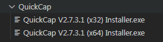

`QuickCap` need .NET Framework 4.0.0 or higher. If you haven't that version or higher, Please install it from official Microsoft website.

You can install QuickCap by opening installer and follow the installer.

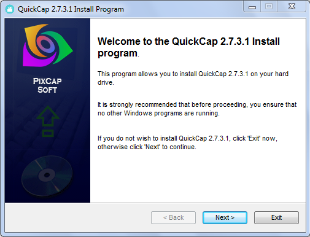

## Update

**How to Update:**

You can update QuickCap by downloading and installing new version. But you will lose your premium subscription.(We will change subscription method in every version). But you can show proof that you are already purchased premium subscription and I will give your new premium subscription for free. Download latest application from [QuickCap](https://github.com/ranujasanmir/QuickCap/tree/main/QuickCap) folder.

## How To Use

**How to use:**

### Home

QuickCap home is like this:

**QuickCap V2.7.3.1:**
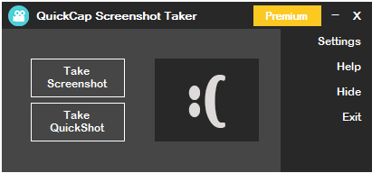

**QuickCap V2.8.4.2:**
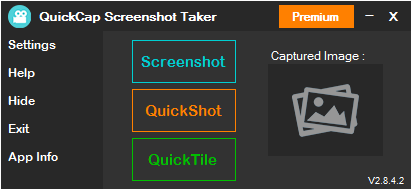

_We will continue future UI same as V2.8.4.2 UI_

### Features

**You can click Screenshot button for take full screen screenshot:**
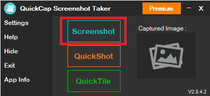

Features - Auto hide QuickCap and take screenshot
         - You can select file format and path to save screenshot
         - You can change time delay for take screenshot from Settings
         - Shortcut Key : Ctrl + S

**Premium users can take Quickshots:**
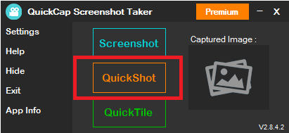

Features - Not hiding QuickCap
         - Take screenshot quickly(No delay)
         - Only save to QuickCap installed folder
         - You can change file format from Settings
         - Shortcut Key : Ctrl + Q

**Quicktile is showing floating button for take screenshot and quickshot:**
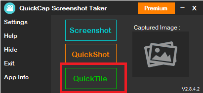

_Quicktile Floating Button:_
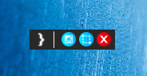

Features - Hide QuickCap
         - Access with small floating button
         - Lightweight
         - Shortcut Key : Ctrl + T

**Get quick access to QuickCap from menu:**
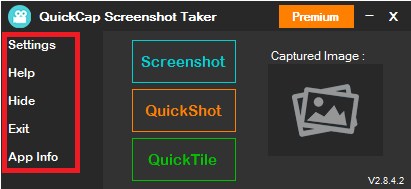

Features - Access to Help, Setting and more
         - Quickly hide QuickCap(Premium)
         - Easy access
         - Shortcuts enabled
           Setting - Ctrl + Shift + S
           Help - Ctrl + H
           Hide - Ctrl + Shift + H
           Exit - Alt + F4

**Change Settings you like:**
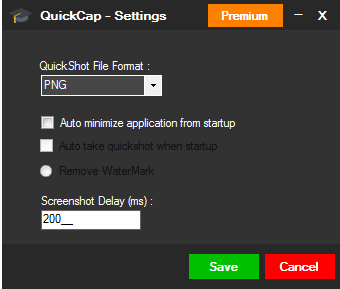

### Premium

**Buy Premium:**
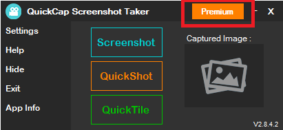

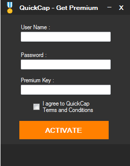

Premium Benefites - Remove watermark
                 - Unlock hide feature
                 - Unlock quickshot feature
                 - Unlock auto take quickshot
                 - Access quickcap from system tray

**How to buy Premium:**
Contact me on [Telegram](https://t.me/PixCap_TM) for buy premium. Lifetime premium subscription is only $2.50. For Sri Lankan customers we will accept bank transfer!
For international customers we do not accept crypto!
We will give you a lifetime warranty.

## Terms And Condition

1. **Use Responsibly**: QuickCap Premium is developed for only personal usage. For other usage you have to buy another premium subscription.

2. **Security**: Virustotal show QuickCap has viruses. Don't worry. It's because we developed this application using old compiler. QuickCap is 1000% secured! 

3. **Privacy**: We do not store any details about you.

## License

This project is licensed under the MIT License - see the [LICENSE](LICENSE) file for details.

## About Us

We are PixCap TM. We are from Sri Lanka. We interest on programming and software development. And we are developing telegram bots. You can find Medusa bot on telegram(Username : @medusa_rs45_bot). This bot has awesome tools for interact with donghua and anime world. Check it out!

**Copyright © 2020-2023 PixCap TM.**
**All rights Reserved.**

